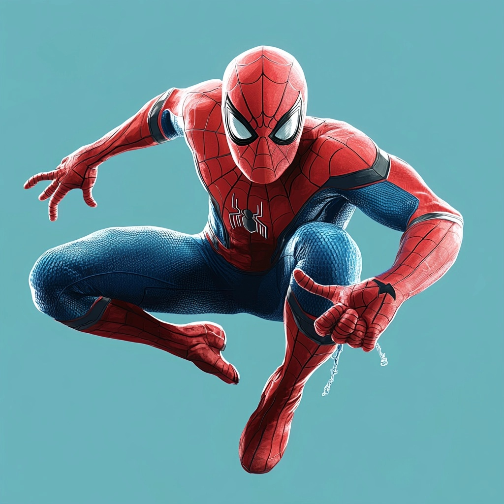
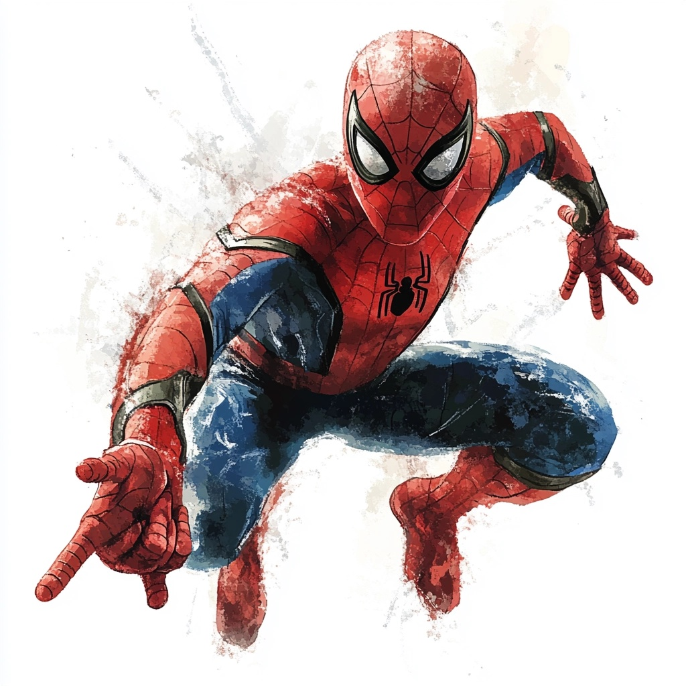

# Spider-Man MidJourney Artwork

This repository contains a collection of Spider-Man artwork images created using MidJourney. These images showcase different artistic interpretations of Spider-Man, capturing the essence of the character in various dynamic poses and settings.

## Images

The repository includes the following images:

1. **Image 1** - Spider-Man portrait close-up.
 
2. **Image 2** - Spider-Man in an action pose, ready to swing.
 
3. **Image 3** - Spider-Man mid-action with web-shooting gesture.
4. **Image 4** - Spider-Man in action with a bold red background.

## Technologies Used

- **MidJourney**: An AI-powered tool for creating stunning visuals based on textual prompts.

## Purpose

These images are intended to demonstrate the versatility of MidJourney in generating artwork for characters like Spider-Man. Feel free to use them for inspiration, or explore how AI can be utilized for character design and creative visual storytelling.

## License

These images are for personal or non-commercial use. If you'd like to use them commercially, please reach out to discuss usage rights.
